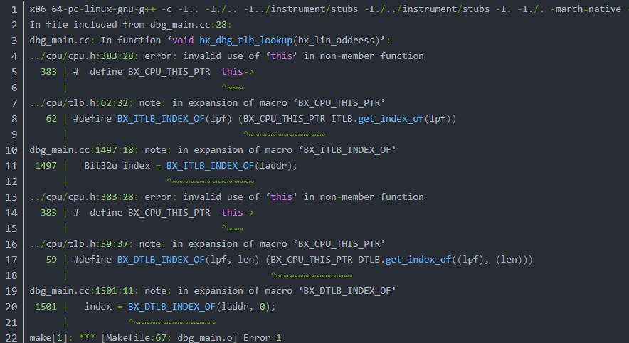
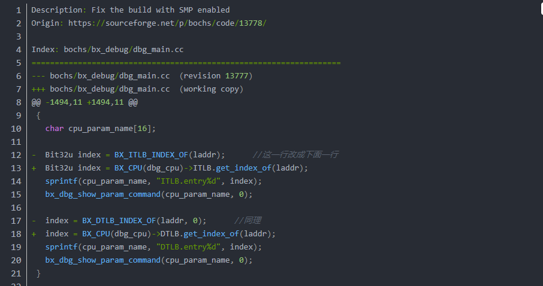

# 《一个64位操作系统的设计与实现》学习总结

## 本仓库说明

[错误]:20210316152315.png
[修改处]:20210316152518.png

1. 本仓库代码运行linux环境 Ubuntu 18.04
2. 书没到多久，慢慢看，尽量稳定更新。
3. 本仓库以自己理解的操作系统体系叙述。
4. 学习github的使用，学习设计操作系统。
5. run bochs-sh.sh file install bochs. 注意脚本里面没有make&&make install，如果直接make&&make install，会出现错误，源代码有个bug，需要先修改。修改后`cd bochs-2.6.11/ make&&make install`
6. 错误信息

7. 修改处!

## 目录
